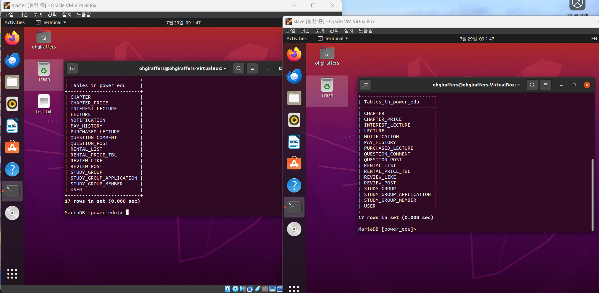
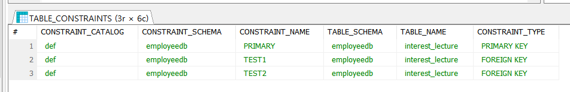

# ※ 인터넷 강의 플랫폼 PowerEdu


## 프로젝트 소개
> **★** `PowerEdu`는 경제적 부담을 줄이고, 유연한 학습을 통해 학습을 더 효율적으로 관리할 수 있는 **혁신적인 플랫폼**입니다.

## 팀원 구성


| **[이은서](https://github.com/eunseo-76)** | **[김태영](https://github.com/wildcat222)** | **[오진석](https://github.com/jinskore)** | **[김지민](https://githu4b.com/kimjm9911)** | **[임광택](https://github.com/Pangtaek)** | **[임채륜](https://github.com/PBEM22)** |
|----|----|----|----|----|----|
|||||||

## 컨벤션

### 브랜치 규칙
- [main] 브랜치에는 직접 커밋을 올리지 않는다.
- 기능 개발을 하기 전에 [main] 브랜치를 기준으로 새로운 브랜치를 만든다.
- 브랜치 이름은 [feature/기능이름] 형식으로 하고 한 명만 커밋을 올린다.
- [feature/기능이름] 브랜치에서 기능 개발이 끝나면 [main] 브랜치에 이를 합친다.

<br>
  
### 커밋 메세지 형식
```sql
fix: (버그 상세 내용) (버그 수정 내용) 
```

```sql
!HOTFIX: (버그 상세 내용) (버그 수정 내용)
```

```sql
docs: (간략 설명)
```

```sql
feat: (기능 상세 내용)
```
```sql
chore: (수정사항)
```

<br>
<br>
<br>

## 프로젝트 기획
### 주제
경제적이고 유연한 강의 대여 서비스와 스터디 그룹 기능을 통해 학습을 지원하는 인터넷 강의 플랫폼

### 소개
`PowerEdu`는 학습자들에게 경제적이고 효율적인 학습 환경을 제공하기 위해 설계된 인터넷 강의 플랫폼입니다. 

기존의 온라인 강의 사이트는 전체 강의를 구매해야 하는 경우가 많아 경제적 부담이 컸습니다. `PowerEdu`는 이러한 문제를 해결하고자 필요한 강의의 일부분만을 대여하여 저렴한 가격에 학습할 수 있는 시스템을 제공합니다. `PowerEdu`는 사용자가 주요 챕터만 선택해 빠르게 학습하거나 특정 주제에 집중할 수 있도록 필요한 부분만 대여할 수 있습니다. 이를 통해 학습 비용을 절감하고 효율적으로 시간을 활용할 수 있습니다. 

수강 목표일을 설정하고 알림을 받는 기능을 통해 학습 계획을 체계적으로 관리할 수 있습니다. 학습 목표에 맞춰 진도를 나갈 수 있도록 지원하여 수강완료할 수 있게 도움을 줍니다.

또한 `PowerEdu`는 같은 목표를 가진 학습자들이 모여 함께 공부할 수 있는 스터디 모집 기능도 제공합니다. 스터디 그룹을 통해 학습의 목표설정과 동기부여를 얻을 수 있습니다. 혼자가면 빠르지만, 같이가면 오래갈 수 있습니다.

`PowerEdu`는 경제적 부담을 줄이고, 유연한 학습을 통해 학습을 더 효율적으로 관리할 수 있는 혁신적인 플랫폼입니다.

### 필요성


온라인 교육 시장은 최근 몇 년 동안 폭발적인 성장세를 보이고 있습니다. 코로나19 팬데믹으로 인한 비대면 교육의 필요성이 높아짐에 따라 온라인 강의 플랫폼 이용자가 급증하였고, 2021년 전 세계 온라인 교육 시장 규모는 14억 7100만 달러였으며, 예측 기간 동안 연평균 복합 성장률(CAGR)은 8.2% 성장해 2028년까지 시장 규모는 2459억 달러에 이를 것으로 예상되었습니다.


하지만 지속적인 성장세와 많은 장점에도 불구하고, 코로나19 팬데믹 이후 급격한 성장세를 보였던 온라인 강의 플랫폼 시장은 최근 엔데믹으로 전환되면서 오프라인 활동 재개와 더불어 수요 감소를 겪고 있습니다. 
이와 더불어 경제 불황으로 인해 체리슈머(소비를 줄이고 저축을 늘리는 소비자)가 증가하며 교육 지출 감소 추세가 나타나고 있습니다. 이러한 변화는 합리적인 온라인 강의 플랫폼의 필요성을 강조합니다.

그래서 `PowerEdu`는 위 사항을 고려하여 다음과 같은 점을 필요성으로 정의하였습니다.

> **경제적 부담 완화**: 기존의 온라인 강의 플랫폼은 전체 강의를 구매해야 하는 경우가 많아 경제적 부담이 큽니다. `PowerEdu`는 이러한 문제를 해결하기 위해 챕터별 대여 시스템을 도입하여, 학생들이 필요한 부분만 선택적으로 구매할 수 있도록 합니다.
 이는 전체 강의를 한 번에 구매해야 하는 부담을 줄여주며, 경제적으로 어려움을 겪고 있는 학생들에게 큰 도움이 됩니다.

> **효율적인 학습 관리**: `PowerEdu`는 사용자가 강의별 또는 챕터별로 수강 목표일을 설정하고, 이를 바탕으로 알림을 받음으로써 학습을 체계적으로 관리할 수 있는 기능을 제공합니다. 이러한 기능은 학생들이 자신만의 학습 계획을 세우고, 목표를 달성하기 위한 동기 부여를 지속적으로 받을 수 있도록 도와줍니다.

> **학습 커뮤니티 형성**: `PowerEdu`는 스터디 모집 기능을 통해 사용자가 같은 목표를 가진 사람들과 그룹을 형성하여 협력하며 학습할 수 있는 환경을 제공합니다. 이러한 커뮤니티는 학습의 질을 높이고, 서로 격려하며 공부할 수 있는 기회를 제공합니다. 학생들은 그룹 내에서 토론을 하고, 서로의 질문에 답변하며, 학습 자료를 공유할 수 있습니다. 전 세계의 학생들과 소통하고, 다양한 관점에서 문제를 해결할 수 있는 능력을 기를 수 있습니다.

### ♣ 타 서비스와의 차이점
**강의 대여 시스템:**  기존의 강의 플랫폼은 전체 강의를 구매해야 하지만, `PowerEdu`는 챕터별로 대여할 수 있는 옵션을 제공합니다. 이를 통해 사용자는 필요한 부분만 학습할 수 있으며, 경제적인 부담을 줄일 수 있습니다.

**목표 설정 및 알림 기능:**  `PowerEdu`는 사용자가 각 챕터별 수강완료 목표일을 설정하고, 목표일이 다가올 때 알림을 받는 기능을 제공합니다. 이를 통해 사용자는 학습 계획을 체계적으로 관리할 수 있습니다.

**스터디 모집 기능:**  사용자가 스터디 그룹을 모집하고 참여할 수 있는 기능을 제공하여, 같은 관심사나 목표를 가진 사용자들이 모여 협력 학습을 할 수 있습니다. 이를 통해 학습의 질과 동기 부여를 높이는 데 큰 도움이 줍니다.

**다양한 학습 지원 기능:**  사용자 인터페이스(UI) 및 경험(UX)을 최적화하여 직관적이고 사용하기 쉬운 플랫폼을 제공합니다. 또한, 모바일 및 데스크탑 환경 모두에 최적화되어 언제 어디서나 학습이 가능합니다.

### 주요 기능
**강의 챕터별 대여**
> 강의를 듣고 싶은 챕터만 대여할 수 있습니다.  

> 이를 통해 강의의 전체 구매에 대한 불필요한 소비를 줄이고, 사용자가 듣고 싶은 강의만을 들을 수 있습니다.

**강의 시청 목표일 알리미**
> 구매 또는 대여한 강의에 대한 목표일을 설정할 수 있고, 설정한 목표일에 대한 알림서비스를 받을 수 있습니다.

> 게으르거나, 까먹고 있을 때 알림 서비스로 한번 더 자각시켜 공부에 임할 수 있게 도와줍니다.

**스터디 그룹**
> 사용자는 스터디를 생성할 수 있고, 허가된 사용자만이 스터디에 가입할 수 있습니다.

> 스터디 그룹을 통해 공부하고 싶은 분야에 대해 함께 공부할 수 있고, 토론 및 토의를 이용해서 서로의 지식을 확인하고 쌓을 수 있습니다.

<br>

## 프로젝트 설계
[요구사항 명세서, 테이블 정의서](https://docs.google.com/spreadsheets/d/1ATtKtcj3g4Hs6ygaoo-ZxcEexlLmGTE5gwCmK3xPfM4/edit?usp=sharing)
[]()

<br>

## 유스케이스


<br>

## ERD테이블


<br>

### 게시글 및 댓글 관련 파트


<br>

### 스터디그룹


### 알림


### 사용자


### 결제 내역, 구매 및 대여 목록


### 강의 관련


## 개발환경
`MariaDB` `Ubuntu` `Linux` 


## 백업계획


> DB를 복제하는 것으로 2대 이상의 DBMS를 master와 slave(또는 다중 slave) 구조로 나누어 비동기 복제 방식으로 데이터를 저장하는 것이다.  
>
> master는 server-id를 1번으로 가지고 slave는 server-id를 2번 이상부터 가지게 되며 서로 고유하게 부여하여 작동 시켜야 된다.

<br>
<br>





<br>

## 회고

<br>

|**이은서**|
|-----------|

> **시도한 것**

- 프로젝트 기획
- 요구사항 명세서 작성
- 테이블 정의서 작성
- ERD 논리/물리 모델링
- Git 협업
- Ubuntu를 이용한 DB 백업(레플리카 서버 구축)
- MariaDB DDL, DML, 트리거 작성

<br>

> **좋았던 점**

 이전에 개인 프로젝트에서 MySQL을 사용해 DB를 구성하고 쿼리를 작성한 적이 있다. 그 때는 테이블도 몇 없고 외래키 같은 개념은 전혀 사용하지 않았다. 이번 팀 프로젝트를 진행하면서, 전체 기능와 참조 관계를 고려하느라 많이 고민했고 팀원들과 의논도 여러 차례 해야만 했다. 혼자 만들 때는 생각지 못한 부분을 발견할 수 있었고, 그때보다 DB에 대한 이해가 깊어져 만족스럽다.

<br>

> **아쉬웠던 점**

 첫째는 기록을 소홀히 했다는 것이다. 요구사항 명세서, 테이블 정의서를 작성했음에도 불구하고 ‘이걸 왜 이렇게 하자고 했더라?’ 라는 생각이 들 때가 많았다. 팀원들과 대화 후 결론을 내린 부분도 이틀이 지나면 결론이 뭐였는지 헷갈렸다. 당시 분위기나 시간적 문제 때문에 두루뭉술하게 넘어간 부분은 특히 그랬다. 만약 명확히 회의록을 남기려고 했다면, ‘잠깐만요, 그래서 정확히 어떻게 하자는 거죠?’ 하고 짚고 넘어갔을 것이다.

 두 번째는 네이밍 컨벤션을 열심히 하지 않았다는 것이다. 테이블 정의서를 작성할 때, 컨벤션을 세세하게 정하지 않았더니 나중에 확인해서 일일이 수정해야하는 번거로움이 생겼다. 누구는 대문자로만 작성하고, 누구는 소문자로 썼다. ‘결제’, ‘구매’, ‘대여’ 컬럼의 이름을 미리 정하지 않아, pay, payment, purchase 등의 단어가 혼재되어 추후 테이블 정의서와 ERD, 쿼리문을 전부 수정해야 했다. 이 다음에는 미리 문제가 될 것 같은 부분을 논의하고 싶다.

 마지막으로, 특정 상황에 FK가 설정되지 않는 문제가 발생했다. 팀원 한 분과 열심히 논의해보았지만 이유를 알 수 없었고, 결국 팀원들에게 이런 문제가 있다고 말했다. 여러 테이블에서 같은 이슈가 있었기 때문에 우리 팀은 PFK를 없애고 인조 식별자를 넣기로 결정했고, DB 구성을 모두 수정했다.

그러나 프로젝트의 마무리에 접어들어, 혼자 다시 시도해보니 FK가 표시만 안 될 뿐 제대로 설정되었다는 사실을 알아차렸다. 만약 나와 다른 팀원 한 분 둘이서 결론짓지 않고, 다른 팀원들에게도 적극적으로 말해 이슈를 자세히 들여다 봐 달라고 하면 어땠을까 하는 생각이 들었다. 다들 맡은 작업을 하느라 바빠 보여 봐 달라고 주장하기를 주저했더니, 더 안 좋은 결과로 이어져 미안하고 아쉬웠다. 

 모든 팀원이 모든 이슈에 대해 자세하게 알 수는 없고, 그럴 필요도 없을 것 같다. 하지만 어디까지 공유해야 하는지 고민이 생겼다.

-------------------------------------------

<br>
<br>
<br>

|**김태영**|
|------|  

> **시도하였던 것**

- 프로젝트 기획
- 유스케이스 다이어그램
- 대여 강의 관련 DDL 작성
- 대여 강의 관련 기능 구현 및 테스트

<br>

> **좋았던 점**

첫 프로젝트라는 점에서 모든 과정이 생소하고, 개발 분야에 대해 입문한 기간이 짧아 다소 위축되어 있어 적극적인 참여에 어려움을 느꼈지만 팀원들에 비해 이해도가 느린 스스로가 못미더워 데이터 모델링, ERD등의 부족한 부분을 이해하고 보충하기 위해 개인 시간을 헛되지 않게 활용할 수 있었고, 데이터베이스 쿼리문 작성 부분에서 팀원들의 다양한 조언을 얻으며 자신감을 회복할 수 있었습니다.

특히, "이런 경우에는 이런 쿼리를 사용하면 될까요?" 라는 질문에 팀원들이 친절하게 들어주고 답변해주어 다양한 시도를 해볼 수 있었고, 각 쿼리문의 용도와 특징을 이해하는 데 큰 도움이 되었습니다.

덕분에 데이터베이스 서버 구축까지 완료하며 데이터베이스와 리눅스에 대한 이해도를 높였고, 다음 프로젝트에서는 더욱 복잡한 쿼리를 효율적으로 작성하고 싶다는 목표를 세우게 되었습니다.

<br>

> **아쉬웠던 점**

첫 프로젝트를 진행하며 데이터 모델링 과정에서 데이터들의 관계를 정의하는 것에 어려움을 느꼈습니다.

카디널리티를 통해 관계가 있는 엔터티들을 나타내는데 있어 수업시간에는 이해했다고 생각했던 것들이 실제로 프로젝트를 진행하며 다루는 데이터의 양이 많아지니 길을 잃은 듯한 느낌을 많이 받았습니다. 또한 프론트엔드, 백엔드, 데이터베이스 각 영역에 대한 명확한 이해 부족으로 어려움을 겪었습니다.

특히, 다양한 테이블 간의 관계를 고려하여 데이터를 조회하거나 수정해야 하는 상황에서 어떤 쿼리문(JOIN, SELECT, INSERT 등)을 사용해야 할지 판단하는 데 어려움을 느꼈습니다.

이러한 혼란은 쿼리문 작성 과정에서 많은 시행착오를 겪었고, 결과적으로 개발 효율을 저하시켰습니다.

 ------

<br>
<br>
<br>


|**임채륜**|
|---------|


> **시도하였던 것**    

- DB 논리 모델링, 물리 모델링
- DB 더미데이터 작성
- SQL 프로시저, 트리거 작성

<br>

> **좋았던 점**

논리 설계, 물리 설계에 대해서 잘 알아갈 수 있었던 프로젝트였던 것 같다. 기초 기반의 중요도를 가장 많이 깨우칠 수 있었다.

<br>

> **아쉬워던 점**

이번 팀플에서 지각, 휴가 등으로 여러 활동들에 참여를 많이 못해서 팀원들한테 너무 죄송합니다. DB구축, 가상 서버 설정 등 여러 가지 해야 할 것들이 있는데 개인적인 사정이라며 참여를 많이 못했다.

그나마 가장 많이 참여했었던 DB 설계에서 설계가 얼마나 중요한지 깨달았고, 진행 하면서도 설계를 다시 고치는 상황이 많았다.


------------------------

<br>
<br>
<br>

|**오진석**|
|-----|

> **시도하였던 것**

- 프로젝트 기획
- 후기게시글 CRUD 및 트리거 테스트 결과서 작성
- ERD 논리/물리 모델 설계

<br>

> **좋았던 점**

- DDL 구문을 작성하기 전에 DB 모델링에 대한 감을 전혀 잡지 못했다. 수업에서 진행했던 실습 예제보다 방대한 데이터를 다루게 되면서 데이터베이스 모델링 과정이 더욱 복잡해졌다. 

특히, 데이터의 중복을 방지하면서도 효율적인 데이터 접근을 위해 테이블을 분할하고 속성 값을 결정하는 과정이 까다로웠다. 

이를 해결하기 위해 정규화 원칙을 따르면서도, 실제 데이터 사용 사례와 쿼리 성능을 고려한 설계를 해야 했다. 

이 모든 일련의 과정은 마치 무에서 유를 창조하는 것과 같았고, 팀원들이 DB 모델링을 수행하는 것을 보며 정말 많은 것을 배울 수 있었다.

현실적으로, 처음부터 모든 것을 완벽하게 고려하며 테이블을 설계하기보다는, 먼저 필요한 테이블과 속성들을 중복이 발생할 수 있더라도 큰 틀에서 구성한 후, 정규화 과정을 통해 보완하는 것이 더 유연하다는 것을 깨달았다. 

이와 같은 접근 방식은 초기 설계의 복잡성을 줄여주고, 나중에 발생할 수 있는 문제를 점진적으로 해결할 수 있는 유연성을 확보 할 수 있었다. 

프로젝트를 진행하지 않았더라면, 팀원들이 어떻게 테이블을 작성해가는 지 확인조차 못했을 텐데, 배운 개념을 직접 반영시킬 수 있어서 확 이해가 빨랐던 것 같다.

---

> **아쉬웠던 점**

- 데이터베이스와 리눅스만 가지고 진행한 프로젝트지만, 나에게 있어 첫 프로젝트였다. 

추후 백엔드와 프론트를 배우며 진행할 때의 프로젝트에서 깨닫는 점이 또 다르겠지만, 해당 프로젝트를 진행하며 커뮤니케이션 능력이 특히 중요하다고 느꼈다. 

중간에 참여하게 된 프로젝트라, 팀원들에게 적극적으로 진행상황은 어디까지며 모르는 부분이 있어도 선뜻 물어보기 어려웠다. 

정확하게 말하면, 내가 모르는 부분을 물어본다는게 부끄럽고 들키고 싶지 않았던 것 같다. 

애초에 배우러 온 것에서 물어본다는 것을 부끄러워한다는 게 빠른 길을 돌아가는 것이었다. 

이러한 경험을 통해, 부족함을 인정하고 적극적으로 질문하는 것이 얼마나 중요한지 깨달았다.

배우는 과정에서 질문하는 것은 결코 부끄러운 일이 아니며, 오히려 팀의 전체적인 효율성을 높이고 개인의 성장을 촉진한다는 것을 알게 되었다.

뿐만 아니라, 명세서 작성 등과 같이 작업을 하기 전 테이블 이름 통일 및 칼럼명을 구체적으로 명시를 하고 팀원들이 공통적으로 사용할 수 있게 끔 하는 작업이 너무나 중요하다는 것을 깨달았다. 

이로 인해, 수정사항이 발생해도 통일이 되지 않아 많은 혼선을 겪게 되어서 다음 프로젝트 시, 초기 작업에 시간을 많이 투자할 것 같다.
 

---------------

<br>
<br>
<br>

|**임광택**|
|------|

> **시도하였던 것**


- ERD 논리 모델 설계
- WBS 작성
- 데이터베이스 트리거, 트랜잭션 작성 및 테스트 결과서 작성

<br>
<br>

> **좋았던 점**

---

이전 프로젝트를 진행하면서 NoSQL Database를 사용하여 프로젝트를 진행하였지만, 관계형 데이터베이스를 사용해보았다는 점이 새로운 것을 공부했다는 것에 만족한다. 

NoSQL 데이터베이스를 사용하니 학교 수업으로만 배웠던 SQL을 직접 작성하고 실행시킨다는것에서 더욱더 만족스러웠던것 같다. 

그중에서 트리거는 수업에서도 배우지 못한 부분인데 이번에 배우고 직접 사용해 보았다. 

내가 작성한 트리거는 스터디그룹에 새로운 멤버가 추가되면 이에 따른 총 인원을 계산해주는 트리거였다. 

그리고 새로운 스터디그룹이 생성되었을 때 스터디그룹 테이블과 스터디그룹멤버테이블에 새로운 스터디를 기록하는 트랜잭션도 작성하고 실행하였다.

<br>
<br>

>  **아쉬워던 점**

-----

외래키 제약조건을 부모 테이블과 자식 테이블 1개만 고려하여 SQL을 작성하려 했다는 점이 아직 부족하다고 생각한다.  

또한, SQL을 작성하면서 문법오류를 많이 범했는데 이또한 계속 공부해 나가면서 극복해야 겠다고 생각한다.

--------------------

<br>
<br>
<br>

|**김지민**|
|---------|

> **시도하였던 것**

- ERD 논리 모델 설계
- 데이터베이스 Trigger, View, CRUD 및 테스트 결과서 작성
- 우분투 서버에 MariaDB 구축

<br>

> **좋았던 점**

학교 수업에서 배웠던 것을 다시 배움으로써 복습할 수 있는 기회가 되었고, 수업에서 배우지 못했던 프로시저와 트리거 작성법에 대해서 배울 수 있었다. 

리눅스를 학교에서 사용하기는 했지만 과제를 제출하는 용도로 사용하였기 때문에 스스로 사용할 명령어를 공부하였는데 몰랐던 명령어도 알게 되었다. 

그리고 서버를 구축하여 백업을 하는 것은 여기서 처음 배웠기 때문에 새로웠다.

<br>

> **아쉬웠던 점**

전공자로 데이터베이스에 대해 배웠지만 여전히 ERD를 만드는 작업에서는 헷갈리는 점이 많았다. 

프로젝트 작업을 더 수행하다 보면 늘 수 있을지 모르겠지만, 다른 사례들을 보면서 고민해보고 연습해봐야겠다. 

그리고 이번 프로젝트에서 회의를 통해 만들기는 했지만 시간적으로 대화가 충분하지 못했기 때문에 나중에 다시 물어보는 일도 있었다. 

다음에는 모르는 부분이나 헷갈리는 부분에서는 적극적으로 더 물어보면서 그 순간에 바로 해결하여 나중에 다시 물어보는 일이 없고 해야 할 일을 바로 할 수 있도록 해야겠다. 

테스트 쿼리문을 만들면서 빠진 컬럼이 있을 때 팀원분들께 말을 하는 부분에서 내가 더 정돈된 채로 말을 했다면 팀원들과 의견을 나눌 때 의견을 잘 전달할 수 있었을 텐데 그러지 못해서 아쉬웠다. 

말을 정리한 후에 어떤 식으로 필요한지 어떤 이유로 말을 하게 되었는지 전달할 수 있도록 해야겠다. 

열심히 한 프로젝트였지만 부족한 점이 많은 것 같아서 아쉬웠지만 다음에는 이를 토대로 더 나은 모습을 보여야겠다.

<br>
<br>


# 어려웠던 상황과 해결 과정

## 1. 특정 상황에서 FK 설정 안 되는 문제

DB의 몇 개 테이블에서 공통적으로 FK가 연결되지 않는(것 처럼 보이는) 문제가 발생했다.

예시)  DA#5에서 생성해준 스크립트를 바탕으로, 아래와 같은 DDL을 하이디 SQL에 작성했다.

```sql
CREATE TABLE `INTEREST_LECTURE`
(
	`CODE` INT NOT NULL PRIMARY KEY COMMENT '코드',
	 `LECTURE_ID`    INT NOT NULL COMMENT '강의ID',
	 `INTEREST_LECTURE_ID` INT NOT NULL COMMENT '관심이 있는 사용자ID',
    `IS_INTERESTED`    BOOLEAN DEFAULT '0' NOT NULL COMMENT '관심등록여부',
 PRIMARY KEY (`LECTURE_ID` , `INTEREST_LECTURE_ID`) ,
  CONSTRAINT `TEST1` FOREIGN KEY(LECTURE_ID)  REFERENCES lecture(LECTURE_ID),
 CONSTRAINT `TEST2` FOREIGN KEY(INTEREST_LECTURE_ID)  REFERENCES user(USER_ID)
) COMMENT = '관심강의';

```


관심 강의 테이블은 1개의 PK와 2개의 PFK를 가지는데, 하이디SQL에서 쿼리문을 작성하니 2개의 PK와 1개의 PFK만 나오는 현상을 발견했다.


(노란키 = PK, 초록키=FK 맞죠?)

쿼리가 잘못된 것 같아 계속 고쳐보고 챗GPT한테도 물어보고 진석님과 논의해봤지만 이유를 알 수 없었다. (다른 팀에서도 같은 이슈가 발생했다고 들음)

팀에게 이 이슈를 공유했고, 우리 팀은 PFK가 정상적으로 생성이 안 된다고 판단, 애꿎은 모든 PFK를 없애게 되었다… 😭


강사님께 하이디SQL GUI 상에서만 FK 연결이 안 됐을 가능성이 있냐고 여쭤보니 아래와 같은 솔루션을 찾아 주셨다.

```sql
CREATE TABLE `INTEREST_LECTURE`
(
	`CODE` INT NOT NULL COMMENT '코드',
	 `LECTURE_ID`    INT NOT NULL COMMENT '강의ID',
	 `INTEREST_LECTURE_ID` INT NOT NULL COMMENT '관심이 있는 사용자ID',
    `IS_INTERESTED`    BOOLEAN DEFAULT '0' NOT NULL COMMENT '관심등록여부',
 PRIMARY KEY (`LECTURE_ID` , `INTEREST_LECTURE_ID`) ,
  CONSTRAINT `TEST1` FOREIGN KEY(LECTURE_ID)  REFERENCES lecture(LECTURE_ID),
 CONSTRAINT `TEST2` FOREIGN KEY(INTEREST_LECTURE_ID)  REFERENCES user(USER_ID)
) COMMENT = '관심강의';

 SELECT * FROM INFORMATION_sCHEMA.TABLE_CONSTRAINTS WHERE TABLE_NAME = 'INTEREST_LECTURE';
```

`CONTRAINT `TEST` FOREIGN KEY` 와 같이 제약조건에 이름을 붙여주고,

`SELECT * FROM INFORMATION_sCHEMA.TABLE_CONSTRAINTS WHERE TABLE_NAME = 'INTEREST_LECTURE';` SELECT로 제약조건의 내용을 확인해보는 것이다.



SELECT로 제약 조건을 확인해보니, 과연 TEST1, TEST2의 제약조건으로 FK 2개가 잘 설정되었다.


`DESC INTEREST_SELECT` 로 추가적으로 PK도 3개가 잘 설정되었음을 확인할 수 있었다. 즉 PFK 2개, FK1개가 잘 설정되었다.

결국 하이디SQL의 GUI 상에서, 어떤 상황에서 FK에 초록색 열쇠가 왜 안 보이는지는 알 수 없었지만, GUI에서만 안 보일 뿐 FK는 잘 설정됨을 확인하였다.

같은 이슈가 발생한 다른 팀이 있다면 참고하셨으면 좋겠다~

<br>

## 2. 순환참조


STUDY_GROUP, STUDY_GROUP_MEMBER, STUDY_GROUP_APPLICATION 테이블

```jsx
DELIMITER //

CREATE TRIGGER `after_member_insert`
AFTER INSERT ON `STUDY_GROUP_MEMBER`
FOR EACH ROW
BEGIN
    UPDATE `STUDY_GROUP`
    SET `CURRENT_MEMBER_COUNT` = (
        SELECT COUNT(*)
        FROM `STUDY_GROUP_MEMBER`
        WHERE `STUDY_GRP_ID` = NEW.`STUDY_GRP_ID`
    )
    WHERE `STUDY_GRP_ID` = NEW.`STUDY_GRP_ID`;
END //

DELIMITER;
```

STUDY_GROUP_MEMBER 테이블이 업데이트 되면 STUDY_GROUP 테이블도 같이 업데이트 되는 트리거

또한 STUDY_GROUP이 업데이트 되면 STUDY_GROUP_MEMBER 테이블도 업데이트 되는 트리거를 작성하였고 실행하려니 오류가 발생하였다.

이렇게 되면 무한 업데이트가 발생하여 이것을 DBMS 자체에서 막는다는 것을 추후에 알게되었다.

그래서 강사님께서 STUDY_GROUP 테이블에 새로운 정보가 업데이트되면 STUDY_GROUP 테이블과 STUDY_GROUP_MEMBER 테이블에 트랜잭션으로 둘 다 INSERT하는 문을 작성해보는 피드백을 주셨고 그렇게 구현하고 테스트하였습니다.

<br>

## 3. 외래키 제약 조건


부모 테이블에 STUDY_GROUP 테이블이 있고 자식 테이블로는 MEMBER와 APPLICATION 테이블이 있는 상황에서  STUDY_GROUP_MEMBER 테이블에 각각의 스터디그룹별 멤버가 0명이면 STUDY_GROUP 테이블의 STUDY_GROUP 테이블의 스터디그룹을 삭제하려는 트리거를 작성했다.

STUDY_GROUP_MEMBER 테이블과 STUDY_GROUP 테이블만 보고 생각했다면, 문제가 없었겠지만, STUDY_GROUP_APPLICATION 테이블에 MEMBER가 0명인 스터디그룹에 신청을 넣었기 때문에 외래키 제약 조건 때문에 삭제가 되지 않았다는 것을 추후에 알게 되었다.